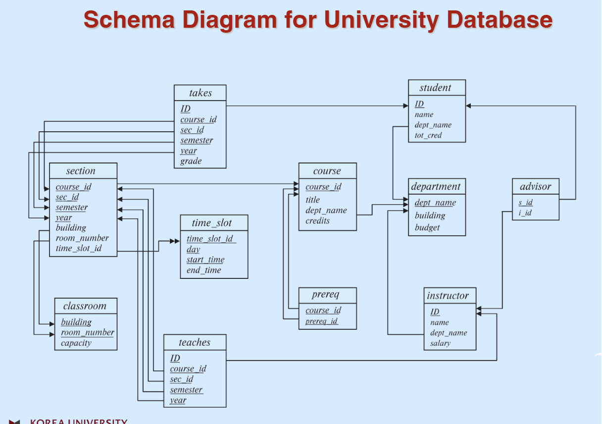

### 키에 대한 복습
---

* 스키마 다이어그램을 보면서 키에 대해 복습해보자.

    * 슈퍼 키나 후보 키는 여러 개 존재할 수 있으나, 기본 키는 0개거나 1개가 최대이다.

    * 일반적으로 관계(relation)은 이 스키마를 묻는다고 생각하면 된다.

        * 학생이라는 relation이 무엇인가?

            > 학생은 {id, name, dept_name, tot_cred}의 속성을 가지는 스키마이다.
        
    * 위의 다이어그램에서 밑줄 친 것들을 모두 합쳐야 하나의 기본 키가 된다.

        * student: {ID}
        
        * instructor: {ID}

        * department: {dept_name}

        * course: {course_id}

        * section: {course_id, sec_id, semester, year}

        * teaches: {ID, course_id, sec_id, semester, year}

        * takes: {ID, course_id, sec_id, semester, year}

        * advisor: {s_id}

        * time_slot: {time_slot_id, day, start_time}

        * prereq: {course_id, prereq_id}

        * classroom: {building, room_number}

    * 특정 관계가 가진 키 값이 다른 테이블의 기본 키가 된다면 이를 외래 키라고 칭한다.

        * 특정 테이블에서 빠져나가는 화살표를 잘 체크하자! 동일 테이블에 화살표가 여러 개 향한다면 하나로 묶어서 생각한다.

            * 만약 동일한 기본 키를 가리키고 있다면 따로 생각한다.

        * student: {dept_name} // 1개

        * instructor: {ID} // 1개

        * department: 외래 키가 없다.

        * course: {dept_name} // 1개

        * section: {course_id}, {building, room_number} // 2개

        * teaches: {ID}, {course_id, sec_id, semester, year} // 2개

        * takes: {ID}, {course_id, sec_id, semester, year} // 2개

        * advisor: {s_id} -> student_id , {i_id} -> instructor_id // 2개

        * time_slot: 외래 키가 없다.

        * prereq: {course_id}, {prereq_id} // 2개, 동일한 테이블을 가리키고 있지만, 동일한 키를 가리키고 있으므로 따로 생각한다.

        * classroom: 외래 키가 없다.

        * section에서 time_slot을 향하는 화살표는 외래 키가 아닌 참조 무결성을 의미한다.

            * section의 time_slot_id는 무조건 time_slot의 time_slot_id 값 중 하나여야 한다는 개념이다.

            * 쉽게 말하면 참조는 하지만, 외래 키는 아니라는 것이다.

### 관계 대수(Relational Algebra)
---
* 관계 모델에 요청(=쿼리)하는 언어는 크게 두 분류로 나눌 수 있다.

    * 절차를 기술하느냐 vs 상태, 상황을 기술하느냐?

        > (Imperative or Functional) vs Declarative

    * Imperative와 Functional은 어떤 요청을 위해 상세한 절차를 거쳐야 한다. 조건식을 자세히 기술해야한다.

        * Imperative와 Functional은 사이드 이펙트(함수 외부의 메모리 변경)의 유무로 구분한다.

    * Declarative는 내가 원하는 상황을 기술하면, DBMS가 알아서 그 상황에 맞는 결과를 내놓는 것이다.

        * 예를 들면, 짝수 집합을 구하고 싶다고 요청하면 짝수가 무엇인지는 DBMS가 판단한다.

    * 우리는 절차적인 관계 대수에 대해 먼저 배울 것이다.

* 관계 대수란 말 그대로 관계를 대수로 사용하는 연산이다.

    * 관계란 Set of tuples 즉 집합으로 정의했으므로, 집합 연산이라고 생각해도 좋다.

* 6개의 기본(Basic) 연산자와 이를 합쳐 만든 추가 연산자가 있다.

    * 입력 argument은 하나(Unary)거나 두 개(Binary) 까지 받을 수 있다. 

        * 입력도 집합으로 이루어지고, 출력도 집합이다!

        * 따라서 관계 대수 연산도 대수로 사용할 수 있다.

    * 기본 연산자 6개는 다음과 같다.

    # Select ($\sigma$)
    ---
    * $\sigma$ 로 표기하며, 입력이 하나인 Unary 연산자이다.

        > $\sigma_p(r)$
    
    * 이때 p는 참 거짓이 판별 가능한 조건식(Selection Predicate)이며, r이라는 테이블, 인스턴스에서 p 조건을 만족하는 튜플을 선택한다.

        * p에는 부등호나 and, or, not 등 논리 연산도 사용가능하다.

        * 조건식에 null이 들어가면 답은 Unknown이 된다 = 사실상 false이다.

    # Project ($\Pi$)
    ---
    * $\Pi$ 로 표기하며, 입력이 하나인 연산자이다.

        > $\Pi_{ID,name,salary}(instructor)$

    * 특정한 속성(칼럼)만 뽑아내는데 사용하는 연산자이다.

        * 위에 식에서는 instructor 테이블에서 id, name, salary를 제외한 모든 칼럼이 사라진다.

        * 남은 테이블에서 동일한 튜플은 마찬가지로 사라진다.
    
    # Set-union ($\cup$)
    ---
    * $\cup$ 로 표기하며, 입력이 두 개(Binary) 연산자이다.

        > $r\cup s$

    * 두 관계를 합치는 합집합 연산이다.

        * 두 관계를 합치기 위해서는 r, s의 스키마가 같아야한다.

            * 즉 속성의 개수(same arity)가 같아야하며, 호환가능해야 한다.

            * 속성의 순서는 상관 없다.

    # Set-Difference (-)
    ---
    * - 로 표기하며, 입력이 두 개인 연산자이다.

        > $r-s$

    * 두 집합을 빼는 차집합 연산이며, **교환법칙이 성립하지 않는다.**

        * 당연히 두 집합의 스키마는 같아야 한다.

    # Cartesian-Product ($\times$)
    ---
    * $\times$ 로 표기하며, 입력이 두 개인 연산자이다.

        > $r\times s$
    
    * 두 집합을 곱하여 수 없이 많은 튜플을 만드는 작업이다.

        * 만약 동일한 이름의 속성이 있다면 테이블의 이름을 붙여 구분한다.

            > ID -> instructor.id, teachs.id

        * 가장 자주 일어나는 작업이며, 의미있는 정보를 따로 뽑아내는 작업이 필요하다.

    # Rename ($\rho$)
    ---
    * $\rho$ (rho)로 표기하며, 입력된 값을 다른 이름으로 명명할 수 있다.

        > $\rho_{x(A1, A2, A3 ... An)}(r)$

    * 관계 r의 이름을 x로 바꾸고, 각 속성을 A1, A2, A3 ... An으로 부르게 된다.